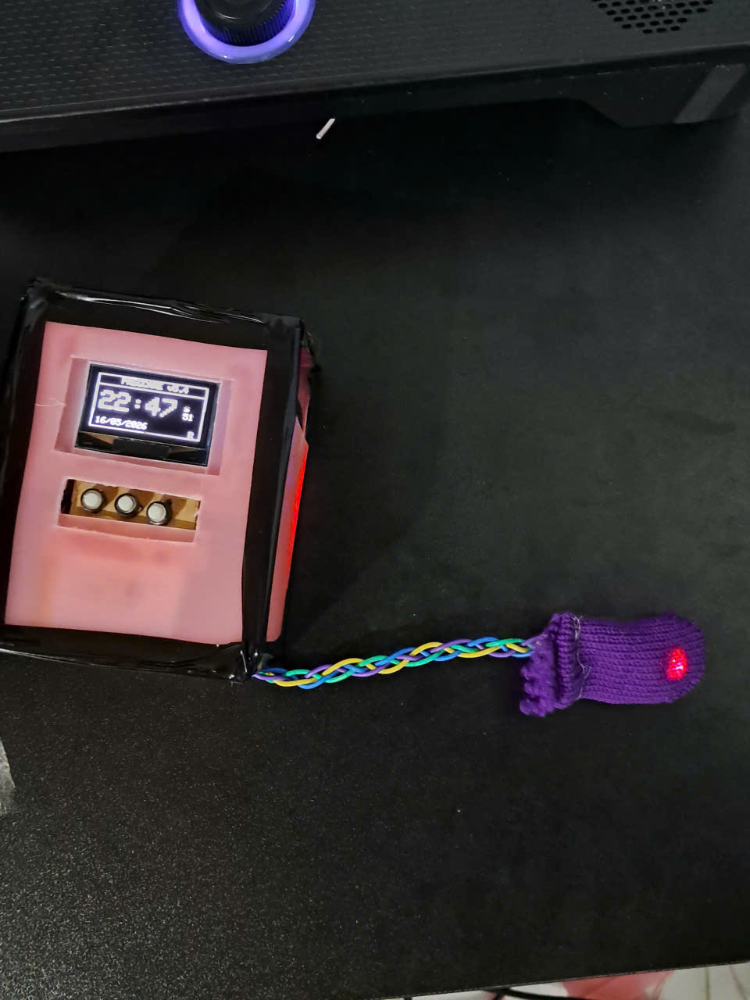
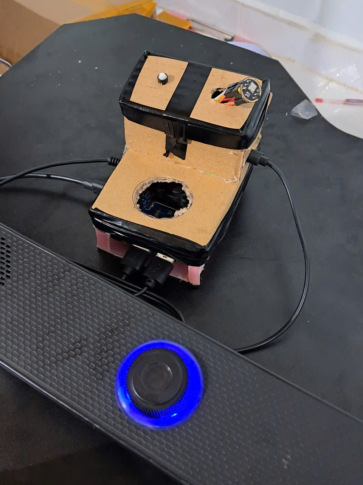
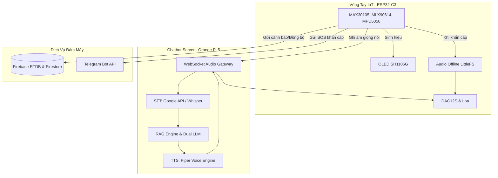
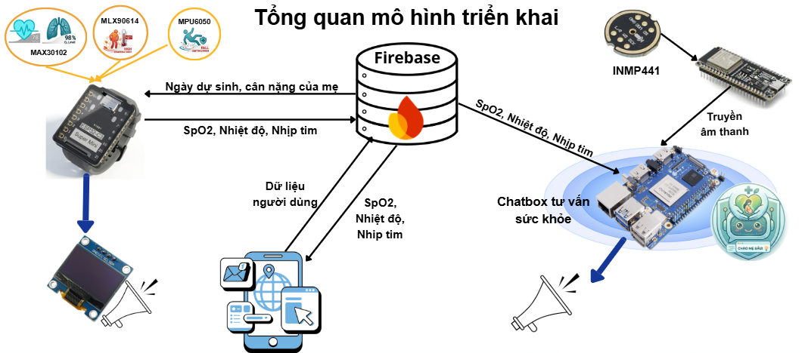

# 🌱 Mầm Nhỏ — Hệ Thống Giám Sát & Cảnh Báo Sức Khỏe Thai Phụ Ứng Dụng IoT
> **PregCare v5.4** — Hệ thống tích hợp vòng tay IoT thông minh và Trợ lý ảo Sản khoa AI (Edge AI) chạy 100% offline.

[](LICENSE)

---

## 📸 Demo & Hình Ảnh Thực Tế

### 🎥 Video Demo Sản Phầm
Xem chi tiết quá trình hoạt động, tính năng trợ lý ảo sản khoa bằng giọng nói và thử nghiệm cảnh báo té ngã thực tế của hệ thống tại YouTube:
👉 **[Xem Video Demo Mầm Nhỏ trên YouTube](https://www.youtube.com/watch?v=swLo6e9jM60)**

[](https://www.youtube.com/watch?v=swLo6e9jM60)

### 🖼️ Hình Ảnh Sản Phẩm
<p align="center">
  
  
</p>

---

## 📌 Giới Thiệu Dự Án
Dự án **Mầm Nhỏ** là giải pháp toàn diện hỗ trợ chăm sóc và giám sát sức khỏe thai phụ từ xa bằng công nghệ IoT kết hợp Trí tuệ Nhân tạo biên (Edge AI). Hệ thống được chia làm hai phần chính hoạt động đồng bộ:
1. **Vòng tay thông minh IoT (Wristband)**: Thu thập sinh hiệu thời gian thực (nhịp tim, SpO2, nhiệt độ), tự động lọc nhiễu chuyển động và phát hiện té ngã. Vòng tay có còi báo rung và loa phát âm thanh cảnh báo trực tiếp từ bộ nhớ cục bộ mà không phụ thuộc vào internet.
2. **Trợ lý Sản khoa AI (Chatbot Server)**: Đóng vai trò là máy chủ biên (Orange Pi 5) xử lý hội thoại giọng nói tiếng Việt qua kết nối WebSocket. Hệ thống sử dụng mô hình RAG kết hợp Dual LLM cục bộ cùng bộ lọc an toàn y khoa khép kín để hỗ trợ tư vấn kiến thức sản khoa.

---

## ⚡ Các Tính Năng Nổi Bật

### 1. Vòng Tay Thông Minh (Firmware `Code_VongTay/`)
* **Giám sát sinh hiệu 3 chỉ số**: Đo nhịp tim (BPM), nồng độ Oxy trong máu (SpO2) và nhiệt độ cơ thể liên tục.
* **Lọc nhiễu chuyển động (IQR Window)**: Áp dụng thuật toán *Interquartile Range* trên cửa sổ trượt 60 mẫu để loại bỏ các điểm dị biệt sinh ra do thai phụ di chuyển tay.
* **Kiểm soát khuếch đại tự động (AGC)**: Điều chỉnh cường độ phát LED của cảm biến đo quang thể tích (PPG) phù hợp với sắc tố da và áp lực tiếp xúc.
* **Phát hiện té ngã 3 giai đoạn (Fall FSM)**: Phân tích gia tốc và vận tốc góc qua MPU6050 để xác định té ngã qua 3 pha: Va chạm mạnh ($>2.5g$) $\rightarrow$ Nghiêng người ($>55^\circ$) $\rightarrow$ Bất động trong 3 giây.
* **Cảnh báo đa tầng offline**:
  * **Tầng 1 (Warning)**: Nhịp tim/SpO2 hơi bất thường $\rightarrow$ Rung nhắc nhở, hướng dẫn thở sâu theo nhịp 4-7-8 bằng giọng nói.
  * **Tầng 2 (Danger)**: Chỉ số nguy hiểm nhẹ $\rightarrow$ Rung mạnh theo nhịp ngắt quãng, phát âm thanh nhắc nhở nằm nghỉ ngơi mỗi 30 giây.
  * **Tầng 3 (Emergency)**: Chỉ số vượt ngưỡng cực hạn hoặc phát hiện té ngã $\rightarrow$ Rung dồn dập, loa kêu gọi cấp cứu liên tục, tự động gửi định vị/tin nhắn khẩn cấp qua **Telegram Bot API**.
* **Đồng bộ Firebase Cloud**: Đồng bộ sinh hiệu lên Firebase Realtime Database và tự động tải dữ liệu thai kỳ (tuần thai, ngày dự sinh đếm ngược) từ Firestore.

### 2. Trợ Lý Sản Khoa AI (Chatbot Server `ChatBotHoTroTuVanSucKhoe/`)
* **WebSocket Audio Gateway**: Nhận luồng âm thanh PCM 16kHz ghi âm trực tiếp từ nút nhấn vòng tay qua mạng Wi-Fi và truyền trả lại âm thanh phản hồi dạng WAV.
* **Phân loại ý định & Viết lại câu hỏi (Qwen 1.5B)**: Nhận diện 5 loại ý định hội thoại của thai phụ và viết lại câu hỏi dựa trên ngữ cảnh bộ nhớ hội thoại 3 lượt gần nhất.
* **RAG Hybrid Search**: Kết hợp tìm kiếm ngữ nghĩa (ChromaDB Vector + Vietnamese-SBERT) và tìm kiếm từ vựng (BM25Okapi) hợp nhất qua thuật toán *Reciprocal Rank Fusion (RRF)*.
* **Mô hình Trợ lý Sản khoa (Qwen 7B Local)**: Lượng tử hóa `Q4_K_M` chạy cục bộ trên CPU biên, trả lời y khoa chuẩn xác dựa trên Context RAG với xưng hô thân thiện ("Mẹ" - "Mầm Nhỏ").
* **Bộ lọc an toàn y khoa (Safety Checker Bypass)**: Quét từ khóa cấp cứu triệu chứng đỏ (chảy máu, co thắt tử cung mạnh, co giật...). Khi phát hiện dấu hiệu nguy kịch, hệ thống tự động bẻ hướng xử lý ra câu trả lời khẩn cấp của Bộ Y Tế ngay lập tức mà không cần gọi LLM (tiết kiệm thời gian trễ và loại bỏ ảo giác).
* **YouTube Music Service**: Cho phép tìm kiếm và mở nhạc thư giãn sản khoa trên YouTube qua Chromium bằng lệnh giọng nói.

---

## 📐 Kiến Trúc Hệ Thống



### 📐 Sơ Đồ Kiến Trúc Chi Tiết


---

## 📂 Cấu Trúc Thư Mục Dự Án

```
SourceCode/
├── Code_VongTay/
│   └── testman.ino                # Mã nguồn Firmware ESP32-C3 (Arduino)
└── ChatBotHoTroTuVanSucKhoe/
    └── PROJECT_MOMCARE/
        ├── data/
        │   └── thai_ky_data.jsonl # Tài liệu y khoa cẩm nang thai sản
        ├── models/                 # Chứa các model AI (tải qua script)
        ├── src/
        │   ├── build_db.py        # Xây dựng Vector DB ChromaDB
        │   ├── rag_engine.py      # Core RAG + Dual LLM
        │   ├── intent_classifier.py # Phân loại ý định
        │   ├── safety_checker.py  # Lọc triệu chứng đỏ khẩn cấp
        │   ├── stt_service.py     # Dịch vụ nhận diện giọng nói
        │   ├── tts_service.py     # Dịch vụ tổng hợp giọng nói
        │   ├── voice_pipeline.py  # Đường ống xử lý hội thoại
        │   └── demo_app.py        # Giao diện kiểm thử Gradio UI
        ├── tests/                  # Kiểm thử tự động (Pytest)
        ├── Dockerfile              # Dockerfile tối ưu hóa ARM64
        ├── docker-compose.yml      # File cấu hình Docker Compose
        └── requirements.txt        # Các thư viện Python cần thiết
```

---

## 🛠️ Hướng Dẫn Cài Đặt

### 1. Nạp Chương Trình Cho Vòng Tay (`Code_VongTay/`)

#### Yêu cầu phần cứng:
* Board mạch **ESP32-C3 Super Mini**.
* Cảm biến đo nhịp tim/SpO2 **MAX30105** (hoặc MAX30102).
* Cảm biến nhiệt độ hồng ngoại **MLX90614**.
* Cảm biến gia tốc/góc quay **MPU6050**.
* Màn hình **OLED SH1106G (I2C)**.
* Mạch giải mã âm thanh **I2S DAC (MAX98357A)** và Loa.
* Motor rung Mini.

#### Các bước nạp code:
1. Mở phần mềm **Arduino IDE** (khuyến nghị v2.x).
2. Cài đặt ESP32 Board Manager (vào Preferences $\rightarrow$ điền URL board manager của ESP32 $\rightarrow$ tải gói board `esp32`).
3. Cài đặt các thư viện sau qua Library Manager:
   * `Adafruit SH110X` (cho OLED SH1106G)
   * `Adafruit MLX90614 Library`
   * `Adafruit MPU6050`
   * `SparkFun MAX3010x Pulse Oximeter Library`
   * `ESP8266Audio` (cho I2S Audio)
4. Upload toàn bộ các file âm thanh cảnh báo `.wav` vào bộ nhớ flash của ESP32 thông qua công cụ **ESP32 Sketch Data Upload** (LittleFS).
5. Mở tệp `testman.ino`, chỉnh sửa cấu hình Wi-Fi (`WIFI_SSID`, `WIFI_PASS`) và thông tin kết nối Firebase / Telegram.
6. Chọn Board là `ESP32C3 Dev Module`, chọn đúng cổng COM và tiến hành nạp code.

---

### 2. Cài Đặt Chatbot Server (`PROJECT_MOMCARE/`)

> [!IMPORTANT]
> Máy chủ cần chạy hệ điều hành Linux (Ubuntu/Debian) hoặc Docker. Khuyến nghị cấu hình tối thiểu RAM 8GB để chạy mượt mà các mô hình ngôn ngữ lớn lượng tử hóa.

#### Bước 1: Cài đặt thư viện Python
Khuyên dùng Python 3.10 hoặc 3.11. Tạo môi trường ảo và cài đặt dependencies:
```bash
cd ChatBotHoTroTuVanSucKhoe/PROJECT_MOMCARE

# Tạo virtual env
python -m venv .venv
source .venv/bin/activate  # Trên Windows dùng: .venv\Scripts\activate

# Cài đặt thư viện
pip install --upgrade pip
pip install -r requirements.txt
pip install gradio gtts soundfile  # Cho demo ứng dụng
```

#### Bước 2: Thiết lập tệp cấu hình `.env`
Sao chép tệp mẫu và điền thông tin kết nối dịch vụ của bạn:
```bash
cp .env.example .env
```
Mở `.env` và thiết lập các biến môi trường:
* Cấu hình Firebase (`FIREBASE_API_KEY`, `FIREBASE_PROJECT_ID`, `FIREBASE_DB_URL`).
* Cấu hình LLM Path, STT/TTS Device (`cpu` hoặc `cuda`).

#### Bước 3: Tải các mô hình AI Offline
Chạy tệp script tự động tải các model từ HuggingFace về thư mục cục bộ `models/`:
```bash
python scripts/download_models.py
```
> Tập tin tải xuống gồm: Qwen-2.5-7B (~4.4GB), Qwen-2.5-1.5B (~1.0GB), Faster-Whisper-Small (~500MB), Vietnamese-SBERT (~400MB).

#### Bước 4: Xây dựng cơ sở dữ liệu Vector RAG
Chuyển đổi dữ liệu cẩm nang thai sản định dạng JSONL sang cơ sở dữ liệu vector ChromaDB:
```bash
python -m src.build_db --reset
```

#### Bước 5: Khởi chạy Trợ lý AI

* **Chạy giao diện Web kiểm thử (Gradio)**:
  ```bash
  python -m src.demo_app
  # Truy cập trên trình duyệt qua địa chỉ: http://localhost:7860
  ```
* **Chạy WebSocket Audio Gateway (Kết nối với vòng tay)**:
  ```bash
  python momcare_audio_gateway.py
  # Máy chủ sẽ lắng nghe kết nối từ ESP32 tại cổng ws://0.0.0.0:8765
  ```

---

## 🐳 Triển Khai Với Docker (Tối ưu cho Orange Pi 5)
Hệ thống hỗ trợ đóng gói Docker Compose giúp triển khai nhanh trên thiết bị biên chạy chip ARM64 (như Orange Pi 5):

1. Gửi thư mục dự án lên thiết bị hoặc clone trực tiếp.
2. Chạy lệnh build image Docker:
   ```bash
   docker compose build
   ```
3. Tạo vector database trong container:
   ```bash
   docker compose run --rm mam-nho-ai python -m src.build_db --reset
   ```
4. Khởi chạy toàn bộ dịch vụ chạy ngầm:
   ```bash
   docker compose up -d
   ```
5. Theo dõi log hoạt động:
   ```bash
   docker compose logs -f
   ```

---

## 🛡️ Tuyên Bố Từ Chối Trách Nhiệm Y Khoa (Medical Disclaimer)
Hệ thống **Mầm Nhỏ** chỉ mang tính chất tham khảo thông tin y tế, không thay thế cho các chẩn đoán, tư vấn, hoặc điều trị chuyên nghiệp từ các bác sĩ sản khoa và nhân viên y tế có chuyên môn. Thai phụ và người nhà tuyệt đối không được tự ý thay đổi phác đồ điều trị khi chưa có chỉ định của bác sĩ.

---

## 📄 Giấy Phép (License)
Dự án được phát hành theo giấy phép **MIT License**. Chi tiết xem tại tệp [LICENSE](LICENSE).
